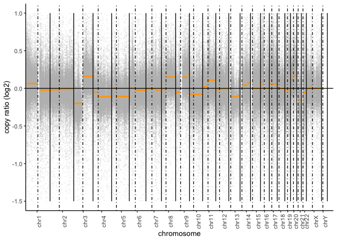
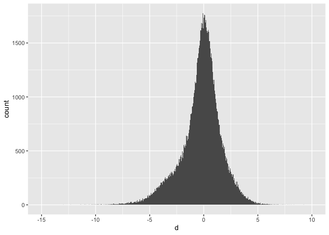
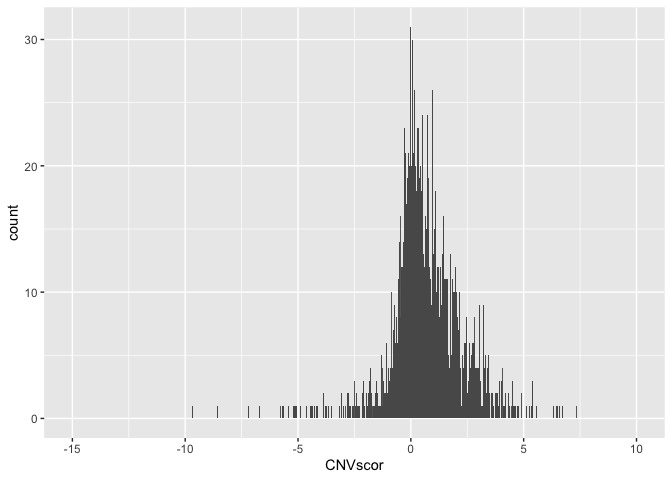
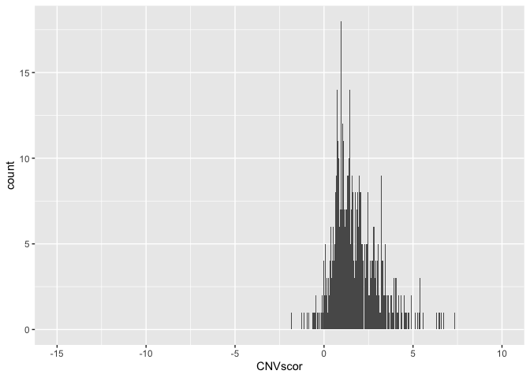
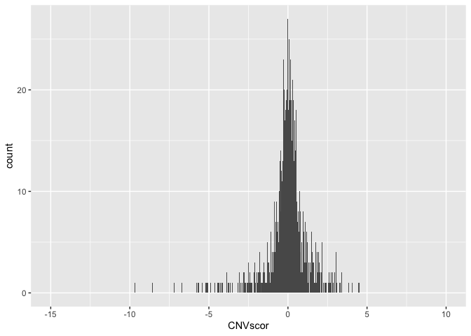
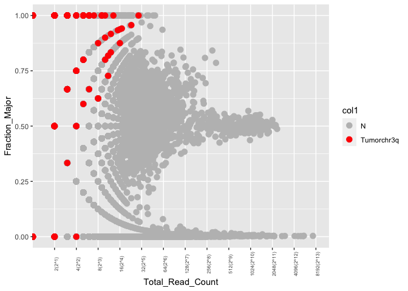
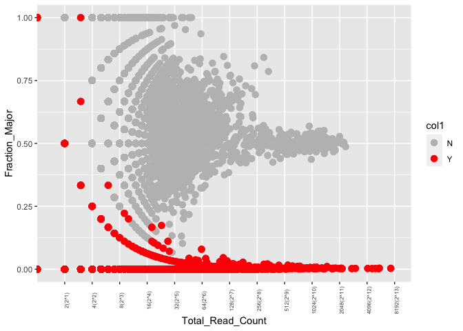
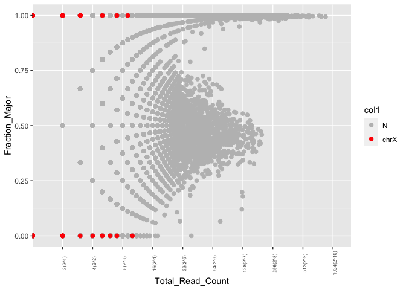

# stmut user guide — scripts of figures and tables for the manuscript.

stmut was developed for analyses of 10x spatial transcriptomics data
when preparing the
[manuscript](place%20holder%20for%20the%20manuscirpt).

This instruction provides an example of how to perform CNVs, point
mutation, and allelic imbalance of 10x spatial transcriptomics data.

# load packages

    library(dplyr)

    ## Warning: package 'dplyr' was built under R version 4.1.2

    ## 
    ## Attaching package: 'dplyr'

    ## The following objects are masked from 'package:stats':
    ## 
    ##     filter, lag

    ## The following objects are masked from 'package:base':
    ## 
    ##     intersect, setdiff, setequal, union

    library(ggplot2)

    ## Warning: package 'ggplot2' was built under R version 4.1.2

    library(tidyr)

    ## Warning: package 'tidyr' was built under R version 4.1.2

    library(stringr)

    ## Warning: package 'stringr' was built under R version 4.1.2

    library(data.table) # for string partially match 

    ## 
    ## Attaching package: 'data.table'

    ## The following objects are masked from 'package:dplyr':
    ## 
    ##     between, first, last

    library(tibble)

    ## Warning: package 'tibble' was built under R version 4.1.2

    library(readxl)

    ## Warning: package 'readxl' was built under R version 4.1.2

    library(stmut)

    # packages for siCNV
    library(devtools)

    ## Warning: package 'devtools' was built under R version 4.1.2

    ## Loading required package: usethis

    ## Warning: package 'usethis' was built under R version 4.1.2

    library(tidyverse)

    ## Warning: package 'tidyverse' was built under R version 4.1.2

    ## ── Attaching packages
    ## ───────────────────────────────────────
    ## tidyverse 1.3.2 ──

    ## ✔ readr   2.1.2     ✔ forcats 0.5.2
    ## ✔ purrr   0.3.4

    ## Warning: package 'readr' was built under R version 4.1.2

    ## Warning: package 'forcats' was built under R version 4.1.2

    ## ── Conflicts ────────────────────────────────────────── tidyverse_conflicts() ──
    ## ✖ data.table::between() masks dplyr::between()
    ## ✖ dplyr::filter()       masks stats::filter()
    ## ✖ data.table::first()   masks dplyr::first()
    ## ✖ dplyr::lag()          masks stats::lag()
    ## ✖ data.table::last()    masks dplyr::last()
    ## ✖ purrr::transpose()    masks data.table::transpose()

    library(Seurat)

    ## Warning: package 'Seurat' was built under R version 4.1.2

    ## Attaching SeuratObject
    ## Attaching sp

    library(ape)

    ## Warning: package 'ape' was built under R version 4.1.2

    library(phylogram)
    library(hdf5r)

    ## 
    ## Attaching package: 'hdf5r'
    ## 
    ## The following object is masked from 'package:purrr':
    ## 
    ##     flatten_df

    library(infercnv)
    library(SpatialInferCNV)

    ## Warning: replacing previous import 'phylogram::as.phylo' by 'ape::as.phylo' when
    ## loading 'SpatialInferCNV'

    #source("/Volumes/Bastian/Limin/projects/scripts/ST_RNA/rFunctions.R")

## Table S1

Supplementary tableS1 – patient4 and patient6 bulk somatic mutations
list

    p4 <- read.table("/Volumes/Bastian/Limin/Ji_data/Patient4/BulkDNASeq/mutations/somaticMML.txt", sep = "\t", header = TRUE, quote = "")
    p6 <- read.table("/Volumes/Bastian/Limin/Ji_data/Patient6/BulkDNASeq/mutations/somaticMML.txt", sep = "\t", header = TRUE, quote = "")
    p4 <- p4[-1,]
    p6 <- p6[-1,]
    df <- rbind(p4,p6)
    Patient <- c(rep("Patient 4", dim(p4)[1]), rep("Patient 6", dim(p6)[1]))

    df1 <- cbind(Patient, df)
    df1$Start_Position <- as.character(df1$Start_Position)
    df1$End_Position <- as.character(df1$End_Position)
    df1$dbSNP_RS <- as.character(df1$dbSNP_RS)

    # tumor allele frequency
    d4 <- read.csv("/Volumes/Bastian/Limin/Ji_data/Patient4/BulkDNASeq/mutations/AJ-03_Pass_Filter_MasterMutationList.csv", header = TRUE, sep = ",", comment.char = "#")
    d4 <- d4 %>% filter(Hugo_Symbol %in% p4$Hugo_Symbol)
    d4 <- d4[-1,]
    d6 <- read.csv("/Volumes/Bastian/Limin/Ji_data/Patient6/BulkDNASeq/mutations/AJ-05_Pass_Filter_MasterMutationList.csv", header = TRUE, sep = ",", comment.char = "#")
    d6 <- d6 %>% filter(d6$Hugo_Symbol %in% p6$Hugo_Symbol)

    UV <- c(d4$UV, d6$UV)
    Tumor_Ref <- c(d4$Tumor_Ref, d6$Tumor_Ref)
    Tumor_Mut <- c(d4$Tumor_Mut, d6$Tumor_Mut)
    Tumor_MAF <- c(d4$Tumor_MAF, d6$Tumor_MAF)

    patho <- read_excel("/Volumes/Bastian/Limin/Ji_data/ST_paper/tabels/TableS1_pathogenicMarked.xlsx")
    patho <- patho[-1,]
    Pathogenic_Mutations <-patho$Pathogenic_Mutations
    df0 <- data.frame(UV,Pathogenic_Mutations, Tumor_Ref, Tumor_Mut, Tumor_MAF)
    df1 <- cbind(df1,df0)

    # add ref and mutant column of Spatial Transcriptomics data to bulk data df1.
    p41 <- read.delim("/Volumes/Bastian/Limin/Ji_data/Patient4/SpatialTranscriptomic/Rep1/PointMutation/AllSpots/mpileupOutput/MpileupOutput_RNA_allSpots.txt",sep = "\t", header = FALSE)
    p41[1,9] <- "Ref1"
    p41[1,10] <- "Mut1"
    colnames(p41) <- p41[1,]
    p41 <- p41[-1,]
    p61 <- read.delim("/Volumes/Bastian/Limin/Ji_data/Patient6/SpatialTranscriptomic/Rep1/PointMutation/AllSpots/mpileup/MpileupOutput_RNA.txt", sep = "\t", header = FALSE)
    p61[1,9] <- "Ref1"
    p61[1,10] <- "Mut1"
    colnames(p61) <- p61[1,]
    p61 <- p61[-1,]
    rep1 <- rbind(p41,p61)
    rep1 <- rep1[,c(1,9,10)]
    p42 <- read.delim("/Volumes/Bastian/Limin/Ji_data/Patient4/SpatialTranscriptomic/Rep2/PointMutation/AllSpots/mpileup/MpileupOutput_RNA.txt", sep = "\t", header = FALSE)
    p42[1,9] <- "Ref2"
    p42[1,10] <- "Mut2"
    colnames(p42) <- p42[1,]
    p42 <- p42[-1,]
    p62 <- read.delim("/Volumes/Bastian/Limin/Ji_data/Patient6/SpatialTranscriptomic/Rep2/PointMutation/AllSpots/mpileup/MpileupOutput_RNA.txt", sep = "\t", header = FALSE)
    p62[1,9] <- "Ref2"
    p62[1,10] <- "Mut2"
    colnames(p62) <- p62[1,]
    p62 <- p62[-1,]
    rep2 <- rbind(p42,p62)
    rep2 <- rep2[,c(1,9,10)]
    df3 <- cbind(df1,rep1)
    df4 <- cbind(df3,rep2)
    df5 <- df4[,-c(20, 23)]

# Spatial Spot Point Mutation

## Figure 1.; Figure 2A.

    #step1
    files <- list.files(path="/Volumes/Bastian/Limin/Ji_data/Patient4/SpatialTranscriptomic/Rep1/PointMutation/AllSpots/spotIndex", pattern = ".txt", full.names = TRUE, recursive = FALSE)
    data1 <- read.csv("/Volumes/Bastian/Limin/Ji_data/Patient4/SpatialTranscriptomic/Rep1/Data/SpacerangerOutput/CloupeFilesManualAlignment/filtered_feature_bc.csv", header = TRUE)
    data2 <- read.csv("/Volumes/Bastian/Limin/Ji_data/Patient4/SpatialTranscriptomic/Rep1/Data/SpacerangerOutput/CloupeFilesManualAlignment/Graph-Based.csv", header = TRUE)
    path <- "/Volumes/Bastian/Limin/Ji_data/Patient4/SpatialTranscriptomic/Rep1/Data/SpacerangerOutput/CloupeFilesManualAlignment/spatial/tissue_positions_list.csv"
    df1 <- sptBClstRds(files, data1, data2, path)

    # step2
    index <- df1[[1]]
    files2 <- list.files(path = "/Volumes/Bastian/Limin/Ji_data/Patient4/SpatialTranscriptomic/Rep1/PointMutation/AllSpots/mpileup", pattern = "MpileupOutput_RNA.txt", full.names = TRUE, recursive = TRUE, include.dirs = TRUE)
    df2 <- sptMutCt(index, files2)

    # step3
    d1 <- df1[[2]]
    d2 <- df2[[1]]
    df3 <- nonZeRdCts(d1,d2)

    # step4
    d3 <- df3[[1]] # NonZeroRdSpotIndex
    path1 <- "/Volumes/Bastian/Limin/Ji_data/Patient4/SpatialTranscriptomic/Rep1/PointMutation/AllSpots/mpileup/"
    df4 <- spotSummary(d3, path1) #NonZeroRdSpotIndex_Scored

    # step5
    df5 <- proposTumLoup(df4,df1[[2]]) # spot point mutation for LoupeBrowser visualization.

## Figure 2B -patient 4 :Generate table for tiling plot to visualize which somatic mutation co-occurred across spots.

    rep1 <- read.csv("/Volumes/Bastian/Limin/Ji_data/Patient4/SpatialTranscriptomic/Rep1/PointMutation/AllSpots/mpileupOutput/MutantSpotIndex_Scored.csv", header = TRUE)
    rep1 <- rep1[,c("spot","GenesWithMutRead")]
    rep1$spot <- paste0("rep1_",rep1$spot)
    rep2 <- read.csv("/Volumes/Bastian/Limin/Ji_data/Patient4/SpatialTranscriptomic/Rep2/PointMutation/AllSpots/mpileup/MutantSpotIndex_Scored.csv", header = TRUE)
    rep2 <- rep2[,c("spot","GenesWithMutRead")]
    rep2$spot <- paste0("rep2_",rep2$spot)

    # create row and column information
    t1 <- rep1$spot
    genes <- c()
    for (e in t1){
      gen <- rep1[match(e,rep1$spot),2]
      gs <- str_split(gen, pattern = ";", simplify = TRUE)
      genes <- append(genes,gs)
    }
    t2 <- rep2$spot
    for (e in t2){
      gen <- rep2[match(e,rep2$spot),2]
      gs <- str_split(gen, pattern = ";", simplify = TRUE)
      genes <- append(genes,gs)
    }
    g2 <- unique(genes)
    g1 <- unique(genes)
    g <- c(g1,g2)

    # how many final rows
    x <- unique(genes)
    y <- x[-match("",x)]
    # create the dataframe
    cNames <- c("GenWithMut",rep1$spot, rep2$spot)
    c <- length(cNames)
    df <- data.frame(matrix(nrow = length(y),ncol = c))
    colnames(df) <- cNames
    df$GenWithMut <- y

    # fill out df, if the mutant gene present in that spot, fill "1", otherwise, fill "0"
    for (e in t1){
      gen <- rep1[match(e,rep1$spot),2]
      gs <- str_split(gen, pattern = ";", simplify = TRUE)
      n <- length(gs)-1
      for (i in 1:n){
        rIdx <- match(gs[i],df$GenWithMut)
        df[rIdx,e] <- 1
      }
    }

    for (e in t2){
      gen <- rep2[match(e,rep2$spot),2]
      gs <- str_split(gen, pattern = ";", simplify = TRUE)
      n <- length(gs)-1
      for (i in 1:n){
        rIdx <- match(gs[i],df$GenWithMut)
        df[rIdx,e] <- 1
      }
    }

    df[is.na(df)] <- 0

    # Reorder the df (saved as cdt file) for JavaTree visualization. First, count the number of mutations in each row; Second, sort top to bottom so that the rows were arranged by the number of mutations (highest at the top and lowest at the bottom); Third, sort left to right for each row so that the samples with mutations clustered to the left within each row.
    df4 <- df
    # add an index column to maintain the gene name order. 
    spt <- seq(-dim(df4)[1])[-1][-1]
    df4 <- cbind(spt, df4) # add a colum to replace gene name
    od <- df4[,c(1,2)] # save gene name and index column for later use.
    df4 <- df4[,-2] #remove gene name column

    df4$rS <- rowSums(df4) # count rowSum for each row
    df4$rS <- df4$rS - df4$spt
    df5 <- df4[order(df4$rS, decreasing = TRUE),] # sorting by the rowSum
    df5 <- df5[,-164] # remove the rowSum column

    # sort by columns, because I only know how to sort by row in r so I transpose the original columns to rows
    df6 <- data.frame(t(df5))
    df7 <- df6[do.call(order,c(df6, list(decreasing=TRUE))),]
    df8 <- data.frame(t(df7))
    df9 <- merge(df8,od, by="spt",sort = FALSE)
    df8 <- df9[,-1]

    CLID <- c("IMAGE:0", paste0("IMAGE:", seq(dim(df8)[1]-1)))
    d1 <- data.frame(CLID, df8$GenWithMut)
    d2 <- df8[,-163]
    dfinal <- cbind(d1,d2)
    name <- names(dfinal)
    colnames(dfinal) <- replace(name, name=="df8.GenWithMut","NAME")

    #write.table(dfinal,file="/Users/limin/limin_practice/p4.cdt", sep = "\t", quote = FALSE, row.names = FALSE)

Then manually move some rows order to make the visualization more
organized for patient 4 of p4.cdt.

# Copy Number Variations (CNVs)

## Bulk CNVs; Figure S1.

    cnr <- read.table("/Volumes/Bastian/Limin/Ji_data/Patient6/BulkDNASeq/CNV/P6_T.deduplicated.realign.cnr", sep = "\t", header = TRUE)
    cns <- read.table("/Volumes/Bastian/Limin/Ji_data/Patient6/BulkDNASeq/CNV/P6_T.deduplicated.realign.cns", sep = "\t", header = TRUE)
    centromere <- read.table("/Volumes/Bastian/Limin/reference/hg19/Centromere.bed")

    bulkCNVs(centmere = centromere, dcnr = cnr, dcns = cns)

    ## Warning: Removed 3373 rows containing missing values (geom_point).

    ## Warning: Removed 12 rows containing missing values (geom_segment).

## Spatial Spot CNVs; Figure 3.

    # step1, merge p6rep1_newSpots_bc.csv and p6rep2_newSptsFeature_bc.csv
    r1g <- read.csv("/Volumes/Bastian/Limin/Ji_data/ST_paper/mergedP6/p6rep1_newSptsFeature_bc.csv", header = FALSE)
    r1gt <- data.frame(t(r1g))
    r1gt[1,1] <- "barcodes"
    r1gbc<- read.csv("/Volumes/Bastian/Limin/Ji_data/Patient6/SpatialTranscriptomic/Rep1/CopyNumber/GroupedSpots/barcode.csv", header = TRUE)
    r1gbc$c3 <- paste0(r1gbc$spots, "_rep1")
    colnames(r1gt) <- r1gt[1,]
    r1gt <- r1gt[-1,]
    newr1 <- merge(r1gbc, r1gt, by = "barcodes")
    r1 <- newr1[,-c(1,2)]
    r1 <- rbind(names(r1),r1)
    r1 <- data.frame(t(r1))
    colnames(r1) <- r1[1,]
    r1 <- r1[-1,]
    r2g <- read.csv("/Volumes/Bastian/Limin/Ji_data/ST_paper/mergedP6/p6rep2_newSptsFeature_bc.csv", header = TRUE)
    r2bc <- read.csv("/Volumes/Bastian/Limin/Ji_data/Patient6/SpatialTranscriptomic/Rep2/CopyNumber/AllSpots/sptBcRds.csv", header = TRUE)
    r2bc$barcode <- str_replace(r2bc$barcode, "-1", ".1")
    bcds <- names(r2g)[-1]
    r2b <- r2bc %>% filter(barcode %in% bcds)
    r2b$c3 <- paste0(r2b$spot, "_rep2")
    r2g1 <- rbind(colnames(r2g),r2g)
    r2g1[1,1] <- "barcode"
    r2g1 <- data.frame(t(r2g1))
    colnames(r2g1) <- r2g1[1,]
    r2g1 <- r2g1[-1,]
    r2new <- merge(r2b , r2g1, by = "barcode")
    r2n <- r2new[,-c(1,2,3)]
    r2n <- rbind(names(r2n), r2n)
    r2 <- data.frame(t(r2n))
    colnames(r2) <- r2[1,]
    r2 <- r2[-1,]
    p6new <- merge(r1, r2, by = "c3") # patient6 grouped csv--p6grouped.csv

    # step2 add cluster name on it; spot and rep combination
    d2 <- r2b[,c(1,2,4)]
    colnames(r1gbc) <- names(d2)

    rep61 <- read.csv("/Volumes/Bastian/Limin/Ji_data/Patient6/SpatialTranscriptomic/Rep1/CopyNumber/AllSpots/sptBcSummary.csv", header = TRUE)
    rep61$barcode <- str_replace(rep61$barcode, "-1",".1")
    rep61 <- rep61 %>% filter(barcode %in% r1gbc$barcode)
    rep61 <- rep61[,c(1,2,3)]
    rep61$cluster <- data.frame(str_split_fixed(rep61$cluster," ",2))
    d61 <- merge(r1gbc, rep61, by = "barcode")
    d61$final <- paste0(d61$c3,"_cluster",d61$cluster$X2)
    d61 <- d61[,c(1,2,3,5,6)]
    colnames(d61) <- c("barcode", "grpSpt","grpSp_rep","spot","final")

    rep62 <- read.csv("/Volumes/Bastian/Limin/Ji_data/Patient6/SpatialTranscriptomic/Rep2/CopyNumber/AllSpots/sptBcSummary.csv", header = TRUE)
    rep62$barcode <- str_replace(rep62$barcode, "-1", ".1")
    rep62 <- rep62 %>% filter(barcode %in% d2$barcode)
    rep62 <- rep62[,c(1,2,3)]
    rep62$cluster <- data.frame(str_split_fixed(rep62$cluster, " ",2))

    test <- read.csv("/Volumes/Bastian/Limin/Ji_data/Patient6/SpatialTranscriptomic/Rep2/CopyNumber/GroupedSpots/newSptsFeature_bc.csv", header = TRUE)
    barcode <- names(test)[-1]
    spot <- paste0("spot", seq(381)-1)
    bcd <- data.frame(barcode, spot) # patient6 rep2 grouped spots barcodes
    bcd$new <- paste0(bcd$spot, "_rep2")
    mergeR2 <- merge(d2, bcd, by="barcode")
    colnames(mergeR2) <- c("barcode", "spot", "sptRep","grpSpt","new")

    d22 <- merge(d2, rep62, by="barcode")
    d22 <- merge(d22, bcd, by="barcode")
    d22$final <- paste0(d22$new,"_cluster",d22$cluster$X2)
    d22 <- d22[,c(1,2,3,6,8)]
    colnames(d22) <- c("barcode","spot","spotRep","grpSpt", "final")

    d11 <- d61

    # # step3 generate spot gene exp file
    # p6 <- p6new
    # spots <- names(p6)
    # n <- length(spots)
    # 
    # for (i in 2:n){
    #   fn <- spots[i]
    #   df <- p6[,c(1,i)]
    #  # write.table(df, file =paste0("/Volumes/Bastian/Limin/Ji_data/ST_paper/mergedP6/txt/",fn,".txt"),sep = "\t", row.names = FALSE, col.names = FALSE, quote = FALSE )
    # }

    # step4: run cnvkit-RNA to calculate CNV of each spot.
    # (cnvkit) limin@DERM-0DUJ1G9-DT cnr % cnvkit.py import-rna -f counts -g /Users/limin/miniconda3/envs/cnvkit/data/ensembl-gene-info.hg38.tsv -c /Users/limin/miniconda3/envs/cnvkit/data/tcga-skcm.cnv-expr-corr.tsv -o output.txt ../txt/*.txt
    ## Dropping 35085 / 36601 rarely expressed genes from input samples
    # (cnvkit) limin@DERM-0DUJ1G9-DT cnr % cnvkit.py export cdt *.cnr -o ../p6GrpMerged.cdt

    # step5: generate weighted arm median one for each cnr file.
    cnrs <- list.files(path = "/Volumes/Bastian/Limin/Ji_data/ST_paper/mergedP6/cnr", pattern = ".cnr", full.names = TRUE, recursive = FALSE)

    # lapply(cnrs, function(x){
    #   cnr <- read.table(x, header = TRUE)
    #   x <- cnrs[1]
    #   sptNs <- str_split(x, "/", simplify = TRUE)
    #   sptN <- sptNs[length(sptNs)]
    #   centm <- read.table("/Volumes/Bastian/Limin/reference/hg38_centromereSimple.bed")
    #   df <- wtArmMedianOne(data = cnr,centmere = centm)
    #   #write.table(df[[1]], file = paste0("/Volumes/Bastian/Limin/Ji_data/ST_paper/mergedP6/armWtedOne/",sptN), row.names = FALSE, col.names = TRUE, quote = FALSE, sep = "\t")
    #   #write.table(df[[2]], file = "/Volumes/Bastian/Limin/Ji_data/ST_paper/mergedP6/armWtedOne/summary.txt", row.names = FALSE, col.names = TRUE, quote = FALSE, sep = "\t")
    # })

    # step6: export cdt file of patient6 grouped weighted median.
    # (cnvkit) limin@DERM-0DUJ1G9-DT armWtedOne % cnvkit.py export cdt *.cnr -o ../p6GrpWt.cdt  

    # step7: rename the column names of p6GrpWt.cdt
    p6re1Sum <- read.csv("/Volumes/Bastian/Limin/Ji_data/ST_paper/mergedP6/p6re1Sum.csv", header = TRUE)
    p6re2Sum <- read.csv("/Volumes/Bastian/Limin/Ji_data/ST_paper/mergedP6/p6re2Sum.csv", header = TRUE)

    df1 <- read.table("/Volumes/Bastian/Limin/Ji_data/ST_paper/mergedP6/cdt/p6GrpWt.cdt", header = TRUE, sep = "\t")
    pre <- df1[,1:4] # only for cdt files
    df1 <- data.frame(t(rbind(names(df1),df1)))
    colnames(df1) <- df1[1,]
    df1 <- df1[-1,]

    df11 <- df1 %>% filter(GID %in% p6re1Sum$grpSp_rep)
    d1 <- p6re1Sum[,c(3,5)]
    colnames(d1) <- c("GID","name")
    final <- merge(d1, df11, by="GID")
    f1 <- final[,-1]
    cls <- data.frame(str_split_fixed(f1$name,pattern = "cluster",2))
    f1 <- cbind(cls$X2, f1)
    f1$`cls$X2` <- as.numeric(f1$`cls$X2`)
    f1 <- f1[order(f1$`cls$X2`),]
    f1 <- f1[,-1]

    # rep2 
    df12 <- df1 %>% filter(GID %in% p6re2Sum$spotRep)
    d2 <- p6re2Sum[,c(3,5)]
    colnames(d2) <- c("GID","name")
    final2 <- merge(d2, df12, by = "GID")
    f2 <- final2[,-1]
    cls <- data.frame(str_split_fixed(f2$name,pattern = "cluster",2))
    f2 <- cbind(cls$X2, f2)
    f2$`cls$X2` <- as.numeric(f2$`cls$X2`)
    f2 <- f2[order(f2$`cls$X2`),]
    f2 <- f2[,-1]
    df <- rbind(f1,f2)
    dft <- data.frame(t(df))
    colnames(dft) <- dft[1,]
    dft <- dft[-1,]
    dft1 <- cbind(pre,dft)
    #write.table(dft1, file = "/Volumes/Bastian/Limin/Ji_data/ST_paper/mergedP6/p6GrpWtClstN.cdt", row.names = FALSE, col.names = TRUE, sep = "\t", quote = FALSE)

    # step8: Final sort the p6GrpWt.cdt by rep-cluster-total reads in p6grouped.csv
    d1 <- read.csv("/Volumes/Bastian/Limin/Ji_data/ST_paper/mergedP6/cdt/p6grpClstN.csv",header = TRUE)
    d1$TotalRds <- rowSums(d1[,-1])

    # extract columns that are used for ordering: rep, cluster, TotalRds
    reps <- data.frame(str_split_fixed(d1$name, pattern = "_",3))
    reps$X2 <- substr(reps$X2,4,4)
    reps$X2 <- as.numeric(reps$X2)
    reps$X3 <- substr(reps$X3,8, nchar(reps$X3))
    reps$X3 <- as.numeric(reps$X3)
    d1$reps <- reps$X2
    d1$cluster <- reps$X3
    t1 <- d1[,c(36603,36604,36605)]
    d11 <- d1[order(d1$reps,d1$cluster,d1$TotalRds),]
    t11 <- d11[,c(1,36603,36604,36605)] # this is used for ordering other cdt files.
    colnames(t11) <- c("NAME","TotalRds","reps","cluster")
    d3 <- read.table("/Volumes/Bastian/Limin/Ji_data/ST_paper/mergedP6/cdt/p6GrpWtClstN.cdt",header = FALSE,sep = "\t",)
    d33 <- data.frame(t(d3))
    keepRs <- d33[1:4,]
    d33 <- d33[-c(1,2,3,4),]
    colnames(d33) <- keepRs[3,]
    df3 <- merge(t11,d33, by="NAME",sort = FALSE)
    df3 <- df3[,-c(2,3,4)]
    colnames(df3) <- names(keepRs)
    df33 <- rbind(keepRs, df3)
    df33 <- data.frame(t(df33))
    #write.table(df33, file = "/Volumes/Bastian/Limin/Ji_data/ST_paper/mergedP6/cdt/p6GrpWtClstRds.cdt", sep = "\t",row.names = FALSE, col.names = FALSE, quote = FALSE)

    # step9: Remove spots which have more than 5% of the data is 0.
    df <- read.table("/Volumes/Bastian/Limin/Ji_data/ST_paper/mergedP6/cdt/p6GrpWtClstRds.cdt", sep = "\t", header = TRUE)

    # save first 4 columns
    cols <- df[,1:4]
    df1 <- df[,-c(1,2,3,4)]
    df11 <- df1[-c(1,2),]
    df12 <- df11 
    df12[] <- lapply(df12, as.numeric) # convert the dataframe to numeric

    # remove spots which has more 5% of cells are 0s.
    a <- dim(df12)[1] # how many rows in total
    df13 <- df12[,colSums(df12 == 0)/a < 0.05]

    df3 <- df %>% dplyr::select(names(df13)) # df13 have 2 rows missing, so use this to include those 2 rows
    df3 <- cbind(cols,df3)
    #write.table(df3, file = "/Volumes/Bastian/Limin/Ji_data/ST_paper/mergedP6/p6GrpWtClstRdsMissRmd.cdt", sep = "\t",row.names = FALSE, col.names = TRUE, quote = FALSE)

    # Remove tumor data to keep the rest for references; Here is the method: adjust the data, by minus each gene by non-tumor median,
    # first exclude tumor clusters: rep1_cluster1, rep1_cluster5, rep2_cluster7, and rep2_cluster4
    # create df4 for getting median
    df4 <- df13[,!grepl(c("rep1_cluster1$|rep1_cluster5|rep2_cluster7|rep2_cluster4"),names(df13))]
    # Minus each cell by the median of the corresponding row in df4 (excluding tumor clusters) from df13
    meds <- apply(df4, 1, median)
    df5 <- df13 - meds # Each col in df13 minus meds
    # get first 2 rows for df
    rows2 <- df %>% select(names(df5))
    df6 <- rbind(rows2[c(1,2),],df5)
    df6 <- cbind(cols,df6)
    #write.table(df6, file = "/Volumes/Bastian/Limin/Ji_data/ST_paper/mergedP6/p6GrpWtClstRdsMissRmdCtdNonTumMedian.cdt", sep = "\t",row.names = FALSE, col.names = TRUE, quote = FALSE)

    # step10:Rank the spots by their similarity to the DNA-seq copy number alterations. 
    cdt <- read.table("/Volumes/Bastian/Limin/Ji_data/ST_paper/mergedP6/cdt/p6GrpWtClstRdsMissRmdCtdNonTumMedian.cdt", sep = "\t", header = TRUE)

    # modify cdt file format to meet CtArmGenes() input requirement.
    cdt1 <- cdt[-c(1,2),-c(1,4)] # 
    data <- read.table("/Volumes/Bastian/Limin/Ji_data/ST_paper/mergedP6/armWtedOne/summary.txt", sep = "\t", header = TRUE)

    ArmGenSumm <- CtArmGenes(cdt = cdt1, data = data)
    #write.csv(ArmGenSumm, file = "/Volumes/Bastian/Limin/Ji_data/ST_paper/mergedP6/CtArmGenSummary.csv", row.names = FALSE)

    # sort the spots based on the CNV signal found in the bulk data
    arm <- c("1p","3p","3q","4q","5q","8q","9q","10p","10q","11q","13p","13q","20p","20q","21q","14q","17q") # FigS1
    df1 <- ArmGenSumm %>% filter(arms %in% arm)
    genes <- df1[,"genes"]
    rs <- df1[,"gene_row"]
    gainLoss <- c(1,-1,1,-1,-1,1,1,-1,-1,1,-1,-1,1,1,-1,1,1)

    df <- cdt_filt_sort(cdt = cdt1,genes = genes,gainLoss = gainLoss,rs=rs)

    ## Warning in xtfrm.data.frame(x): cannot xtfrm data frames

    #write.table(df, file = "/Volumes/Bastian/Limin/Ji_data/ST_paper/mergedP6/p6NonTumMedianCNVsorted.cdt", sep = "\t",row.names = FALSE, quote = FALSE)

the p6NonTumMedianCNVsorted1.cdt is the final cdt file, which is
visualized in JavaTreeview to make Figure3.

## Figure S3B.; patient 4–tables for tumor, no tumor, no tissue regions

    # patient 4 rep1
    r1 <- read.csv("/Volumes/Bastian/Limin/Ji_data/ST_paper/nonTissue_heatmap/tumor_regions/regionAutoalinRep1.csv", header = TRUE)
    r1[r1==""]<- "nonTissue"
    data <- read.csv("/Volumes/Bastian/Limin/Ji_data/Patient4/SpatialTranscriptomic/Rep1/Data/SpacerangerOutput/CloupeFilesAutoAlignment/filtered_feature_bc.csv", header = TRUE)
    data <- data[,-1]
    data1 <- data.frame(names(data), colSums(data))
    colnames(data1) <- c("Barcode", "reads")
    data1$Barcode <- str_replace(data1$Barcode, ".1", "-1")

    rep1 <- merge(r1, data1, by = "Barcode")
    for (rg in unique(rep1$tumor)){
      df <- rep1 %>% filter(tumor == rg)
      med <- median(df$reads)
      print(paste0(rg, " median reads is ", med))
    }

    ## [1] "tumor median reads is 21613.5"
    ## [1] "nonTissue median reads is 304"
    ## [1] "nonTumor median reads is 8545.5"

    # add 0s to spots with 0 reads.
    dr1 <- rep1 %>% filter(tumor == "nonTissue")
    v3 <- c(dr1$reads, rep(0, 1056))
    median(v3)

    ## [1] 212

    # patien4 rep2
    r2 <- read.csv("/Volumes/Bastian/Limin/Ji_data/ST_paper/nonTissue_heatmap/tumor_regions/regionAutoalinRep2.csv", header = TRUE)
    r2[r2==""]<- "nonTissue"
    data2 <- read.csv("/Volumes/Bastian/Limin/Ji_data/Patient4/SpatialTranscriptomic/Rep2/Data/SpacerangerOutput/CloupeFilesAutoAlignment/outs/filtered_feature_bc.csv", header = TRUE)
    data2 <- data2[,-1]
    data3 <- data.frame(names(data2), colSums(data2))
    colnames(data3) <- c("Barcode", "reads")
    data3$Barcode <- str_replace(data3$Barcode, ".1", "-1")

    rep2 <- merge(r2, data3, by = "Barcode")
    for (rg in unique(rep2$tumor)){
      df <- rep2 %>% filter(tumor == rg)
      med <- median(df$reads)
      print(paste0(rg, " median reads is ", med))
    }

    ## [1] "nonTissue median reads is 215"
    ## [1] "tumor median reads is 25201"
    ## [1] "nonTumor median reads is 9157.5"

    # combined median
    for (rg in unique(rep2$tumor)){
      df1 <- rep1 %>% filter(tumor == rg)
      df2 <- rep2 %>% filter(tumor == rg)
      med <- median(c(df1$reads,df2$reads))
      print(paste0(rg, " median reads is ", med))
    }

    ## [1] "nonTissue median reads is 248"
    ## [1] "tumor median reads is 23284"
    ## [1] "nonTumor median reads is 9000"

    # tissue median
    df1 <- rep1 %>% filter(tumor != "nonTissue")
    df2 <- rep2 %>% filter(tumor != "nonTissue")
    d <- c(df1$reads, df2$reads)
    median(d)

    ## [1] 16709

    d1 <- rep1 %>% filter(tumor == "nonTissue")
    d2 <- rep2 %>% filter(tumor == "nonTissue")
    nonTis <- c(d1$reads, d2$reads, rep(0,4992-3936)) 
    median(nonTis)

    ## [1] 213

    # barplot of mutant spots/mm2 for the benign tissue and the no tissue. and add confidence intervals
    tis <- c("Benign Tissue", "No Tissue")
    val <- c(1.45, 0.15)
    CIl <- c(0.6939781,0.07590766)
    CIh <- c(2.6614119,0.27207684)

    df <- data.frame(tis, val, CIl, CIh)

    ggplot(data=df, aes(x=tis, y=val)) +
      geom_bar(stat = "identity", width = 0.5)+
      geom_errorbar(aes(ymin=CIl, ymax=CIh), colour="black", width=.05, position = "identity")+
      xlab("Capture Area") +
      ylab("Mutations/mm2") + 
      theme(aspect.ratio = 2/1) 

    #ggsave("/Volumes/Bastian/Limin/Ji_data/ST_paper/nonTissue_heatmap/tumor_regions/mutationCI.pdf")

## Figure S4

    cdt0 <- read.table("/Volumes/Bastian/Limin/Ji_data/ST_paper/mergedP6/cdt/p6NonTumMedianCNVsorted1.cdt", sep = "\t", header = TRUE)
    ArmGenSumm <- read.csv("/Volumes/Bastian/Limin/Ji_data/ST_paper/mergedP6/cdt/CtArmGenSummary.csv", header = TRUE)
    # sort the spots based on the CNV signal found in the bulk data
    arm <- c("1p","3p","3q","4q","5q","8q","9q","10p","10q","11q","13p","13q","20p","20q","21q","14q","17q") # FigS1

    permuts <- CNVpermut(m=3, cdt0 = cdt0, armGens = ArmGenSumm, arm = arm, gainLoss = gainLoss)

    ## Case CNV plot
    cdt0 <- read.table("/Volumes/Bastian/Limin/Ji_data/ST_paper/mergedP6/cdt/p6NonTumMedianCNVsorted1.cdt", sep = "\t", header = TRUE)
    df <- caseCNVscore(cdt0, armGens = ArmGenSumm, arm = arm, gainLoss = gainLoss)

    ## Warning in xtfrm.data.frame(x): cannot xtfrm data frames

    #write.table(df, file = "/Volumes/Bastian/Limin/Ji_data/ST_paper/mergedP6/permutation2/p6CNVscores.csv", sep = ",", row.names = TRUE, col.names = FALSE, quote = FALSE )

    # Create patient/sample spots CNVscore dataframe and permuts scores dataframe, and rank them from high to low score
    scores <- permutScore(sptScor = df, permuts = permuts)
    sptScor1 <- scores[[1]]
    permD <- scores[[2]]
    #write.csv(sptScor1, file = "/Volumes/Bastian/Limin/Ji_data/ST_paper/mergedP6/permutation2/p6permutSumm1.csv", row.names = FALSE)
    #write.csv(permD, file = "/Volumes/Bastian/Limin/Ji_data/ST_paper/mergedP6/permutation2/permut100Summ1.csv", row.names = FALSE)

    # FDR_based tumor classification
    data <- read.csv("/Volumes/Bastian/Limin/Ji_data/ST_paper/mergedP6/permutation2/p6permutSumm1.csv", header = TRUE)
    rep2 <- read.csv("/Volumes/Bastian/Limin/Ji_data/ST_paper/mergedP6/p6re2Sum.csv", header = TRUE)
    d1 <- read.csv("/Volumes/Bastian/Limin/Ji_data/Patient6/SpatialTranscriptomic/Rep2/CopyNumber/GroupedSpots/groupedSpts.csv", header = TRUE)
    d4 <- read.csv("/Volumes/Bastian/Limin/Ji_data/Patient6/SpatialTranscriptomic/Rep2/CopyNumber/AllSpots/sptBcRds.csv", header = TRUE)
    p6r2Dat <- fdrTumor(a=0, b=1.82,c=4.4, data1 = data, data2 = rep2, data3 = d1, data4 = d4) # FDR_based tumor groups for Loupe visualization

    # Figure 4A.
    permuts <- read.csv("/Volumes/Bastian/Limin/Ji_data/ST_paper/mergedP6/permutation2/permuts100.csv", header = TRUE)
    # plot all permutes data as one
    d <- c()
    for (i in 1:dim(permuts)[2]){
      d <- append(d,permuts[,i])
    }
    dd <- data.frame(d)
    ggplot(dd, aes(x=d)) +
      geom_histogram(binwidth = 0.04) +
      xlim(-15, 10)

    ## Warning: Removed 2 rows containing missing values (geom_bar).

    #ggsave("/Volumes/Bastian/Limin/Ji_data/ST_paper/mergedP6/permutation2/permutation100.png")

    # plot patient6 observed score histogram
    p6 <- read.csv("/Volumes/Bastian/Limin/Ji_data/ST_paper/mergedP6/permutation2/p6permutSumm1.csv", header = TRUE)
    ggplot(p6, aes(x=CNVscor)) +
      geom_histogram(binwidth = 0.04) +
      xlim(-15, 10)

    ## Warning: Removed 2 rows containing missing values (geom_bar).

    #ggsave(filename = "/Volumes/Bastian/Limin/Ji_data/ST_paper/mergedP6/permutation2/p6.png")

    # plot p6 tumor, non-tumor clusters
    tumor <- c("rep1_cluster1 | rep1_cluster5 | rep1_cluster10 | rep2_cluster4 | rep2_cluster7")
    tumor <- c("rep1_cluster1","rep1_cluster5","rep1_cluster10","rep2_cluster4","rep2_cluster7")
    tumSpt <- grepl(paste0(tumor, collapse = "|"), p6$spot)
    d1 <- p6[tumSpt,]
    ggplot(d1, aes(x=CNVscor)) +
      geom_histogram(binwidth = 0.04) +
      xlim(-15, 10)

    ## Warning: Removed 2 rows containing missing values (geom_bar).

    #ggsave(filename = "/Volumes/Bastian/Limin/Ji_data/ST_paper/mergedP6/permutation2/p6Tumor.png")

    # plot p6 non-tumor histogram
    d2 <- p6 %>% filter(! p6$spot %in% d1$spot)
    ggplot(d2, aes(x=CNVscor)) +
      geom_histogram(binwidth = 0.04) +
      xlim(-15, 10)

    ## Warning: Removed 2 rows containing missing values (geom_bar).

    #ggsave(filename = "/Volumes/Bastian/Limin/Ji_data/ST_paper/mergedP6/permutation2/p6NonTumor.png")

    ## Figure 4B. - QQ plot
    pemts <- read.csv("/Volumes/Bastian/Limin/Ji_data/ST_paper/mergedP6/permutation2/permut100Summ1.csv", header = TRUE)

    # create downsampled data for QQ plot.
    downS <- c()
    i = 50
    for (n in 1:1384){
      a <- pemts$PermutScore[i]
      downS <- append(downS, a)
      i = i + 100
    }

    data1 <- data.frame(p6$CNVscor, downS)
    colnames(data1) <- c("CNVscore", "PermutScore")

    ### Create summary data
    p61 <- read.csv("/Volumes/Bastian/Limin/Ji_data/ST_paper/mergedP6/p6re1Sum.csv", header = TRUE)
    p61$barcode <- str_replace(p61$barcode, ".1", "-1")
    p62 <- read.csv("/Volumes/Bastian/Limin/Ji_data/ST_paper/mergedP6/p6re2Sum.csv", header = TRUE)
    p62$barcode <- str_replace(p62$barcode, ".1", "-1")
    colnames(p62) <- names(p61)

    pGrp1 <- read.csv("/Volumes/Bastian/Limin/Ji_data/ST_paper/mergedP6/permutation2/p6rep1_Loupe.csv", header = TRUE)
    pGrp1 <- pGrp1 %>% filter(barcode %in% p61$barcode)
    pGrp2 <- read.csv("/Volumes/Bastian/Limin/Ji_data/ST_paper/mergedP6/permutation2/p6rep2_Loupe.csv", header = TRUE)
    pGrp2 <- pGrp2 %>% filter(barcode %in% p62$barcode)
    p611 <- merge(p61, pGrp1, by = "barcode")
    p622 <- merge(p62, pGrp2, by = "barcode")

    p612 <- rbind(p611, p622)
    p612 <- p612 %>% filter(final %in% p6$spot)
    colnames(p612) <- c("barcode","grpSptN","Spt_rep","spotN","spot","Group")

    p6Sum <- merge(p6,p612, by = "spot")
    write.csv(p6Sum, file = "/Volumes/Bastian/Limin/Ji_data/ST_paper/mergedP6/permutation2/p6SummaryAll.csv", row.names = FALSE)
    p6sub <- p6Sum[,c("spot","CNVscor","Group" )]
    p6sub <- p6sub[order(p6sub$CNVscor, decreasing = TRUE),]
    cnvScor <- cbind(p6sub,downS)
    cnvScor$color <- rep(0, dim(cnvScor)[1])

    group.cols <- c(A = "#c23728", B = "#e1a692", C= "##FFFFFF",D= "#1984c5")
    for (i in 1:dim(cnvScor)[1]){
      if(cnvScor[i,3] == "Tumor"){
        cnvScor[i,5] = "#c23728"
      }else if(cnvScor[i,3] == "Potential_Tumor"){
        cnvScor[i,5] = "#e1a692"
      }else if(cnvScor[i,3] == "Tossup"){
        cnvScor[i,5] = "#FFFFFF"
      }else{
        cnvScor[i,5] = "#1984c5"
      }
    }

    # rename group
    cnvScor[cnvScor == "Tumor"] <- "Likely tumor"
    cnvScor[cnvScor == "Potential_Tumor"] <- "Possibly tumor"
    cnvScor[cnvScor == "Tossup"] <- "Unclear Identity"
    cnvScor[cnvScor == "Non_tumor"] <- "Not Likely tumor"

    ggplot(cnvScor, aes(x = downS, y = CNVscor, colour = Group)) +
      geom_point(shape = 1) +
      geom_abline(slope = 1, intercept = 0, colour = "black", lty = 2) +
      ylim(c(-10, 10)) +
      xlim(c(-10,10)) +
      scale_colour_manual(values = setNames(cnvScor$color, cnvScor$Group)) +
      xlab("PermutScore")+
      ylab("CNVscore") 

    # Figure S4 Loupe_images; rep1
    # grouped all spots
    allBarcodes <- read.csv("/Volumes/Bastian/Limin/Ji_data/ST_paper/mergedP6/permutation2/p6rep1_Loupe.csv", header = TRUE)
    JiD <- read.csv("/Volumes/Bastian/Limin/Ji_data/Patient6/SpatialTranscriptomic/Rep1/Data/SpacerangerOutput/CloupeFilesManualAlignment/Graph-Based1.csv", header = TRUE)

    outs <- allBarcodes %>% filter(Group == "out")

    # original all spots
    all1 <- read.csv("/Volumes/Bastian/Limin/Ji_data/Patient6/SpatialTranscriptomic/Rep1/Data/SpacerangerOutput/CloupeFilesFromJiEtAlCell/Graph-Based.csv", header = TRUE)

    left <- all1 %>% filter(! Barcode %in% outs$barcode)
    colnames(left) <- names(outs)

    all2 <- read.csv("/Volumes/Bastian/Limin/Ji_data/Patient6/SpatialTranscriptomic/Rep1/Data/SpacerangerOutput/CloupeFilesManualAlignment/Graph-Based.csv", header = TRUE)
    all2 <- all2 %>% filter(!Barcode %in% outs$barcode)
    tumor <- all2 %>% filter(Graph.based %in% c("Cluster 1","Cluster 5","Cluster 10"))
    nontumor <- all2 %>% filter(!Graph.based %in% c("Cluster 1","Cluster 5","Cluster 10"))

    tumor <- data.frame(tumor$Barcode, rep("tumor", dim(tumor)[1]))
    colnames(tumor) <- names(outs)
    nontumor <- data.frame(nontumor$Barcode, rep("nontumor", dim(nontumor)[1]))
    colnames(nontumor) <- names(outs)
    newGrap <- rbind(tumor, nontumor, outs)

    # there are 9 spots that are left out when I do manual alignment. To plot, I need to remove those spots.
    out2 <- data.frame(setdiff(JiD$Barcode, allBarcodes$barcode),rep("out",length(setdiff(JiD$Barcode, allBarcodes$barcode))))
    colnames(out2) <- names(newGrap)
    newGrap <- rbind(newGrap, out2)
    #write.csv(newGrap, file = "/Volumes/Bastian/Limin/Ji_data/ST_paper/mergedP6/permutation2/GroupedAllspt_Loup.csv", row.names = FALSE)

## Figure S5: Patient6 rep1

    clts <- read.csv("/Volumes/Bastian/Limin/Ji_data/Patient6/SpatialTranscriptomic/Rep1/Data/SpacerangerOutput/CloupeFilesManualAlignment/Graph-Based.csv")
    clts$annot <- rep(0, nrow(clts))

    for (i in 1:nrow(clts)){
      if (clts[i,"Graph.based"] %in% c("Cluster 1","Cluster 5","Cluster 10")){
        clts[i,"annot"] <- "tumor"
      }else if (clts[i,"Graph.based"] %in% c("Cluster 3")){
        clts[i,"annot"] <- "normal_epithelia"
      }else{
        clts[i,"annot"] <- "stroma"
      }
    }
    clts <- clts[,c(1,3)]
    #write.csv(clts, file = "/Volumes/Bastian/Limin/Ji_data/Patient6/SpatialTranscriptomic/Rep1/CopyNumber/Spatial_inferCNVs/histoAnnot.csv", row.names = FALSE, quote = FALSE)

    # # annotation
    # histology <- ImportHistologicalAnnotations("P6R1", "/Volumes/Bastian/Limin/Ji_data/Patient6/SpatialTranscriptomic/Rep1/CopyNumber/Spatial_inferCNVs/histoAnnot.csv")
    # 
    # # counts
    # scc_ENSBMLID_Counts <- ImportCountData("P6R1", "/Volumes/Bastian/Limin/Ji_data/Patient6/SpatialTranscriptomic/Rep1/Data/SpacerangerOutput/CloupeFilesManualAlignment/filtered_feature_bc_matrix.h5")
    # 
    # # merge
    # mergedHistology <- MergingCountAndAnnotationData("P6R1", histology, scc_ENSBMLID_Counts)
    # mergedHistology <- mergedHistology %>% column_to_rownames(var = "Genes")
    # 
    # #write.table(mergedHistology,"/Volumes/Bastian/Limin/Ji_data/Patient6/SpatialTranscriptomic/Rep1/CopyNumber/Spatial_inferCNVs/AnnotHistologyCount.tsv", sep = "\t")
    # 
    # mergedAnnotation <- FinalAnnotations(histology, mergedHistology)
    # #write.table(mergedAnnotation,"/Volumes/Bastian/Limin/Ji_data/Patient6/SpatialTranscriptomic/Rep1/CopyNumber/Spatial_inferCNVs/Annotation.tsv", sep = "\t", quote = FALSE, col.names = FALSE, row.names = FALSE)
    # 
    # P6R1_inferCNV <- infercnv::CreateInfercnvObject(raw_counts_matrix = "/Volumes/Bastian/Limin/Ji_data/Patient6/SpatialTranscriptomic/Rep1/CopyNumber/Spatial_inferCNVs/AnnotHistologyCount.tsv",
    #                                                 gene_order_file = "/Volumes/Bastian/Limin/Ji_data/Patient4/SpatialTranscriptomic/Rep1/CopyNumber/spatial_infer_CNVs/gene_pos.tsv",
    #                                                 annotations_file = "/Volumes/Bastian/Limin/Ji_data/Patient6/SpatialTranscriptomic/Rep1/CopyNumber/Spatial_inferCNVs/Annotation.tsv",
    #                                                 delim = "\t",
    #                                                 ref_group_names = NULL,
    #                                                 chr_exclude = c("chrM"))
    # 
    # P6R1InferCNV = infercnv::run(P6R1_inferCNV,
    #                              cutoff = 0.1,
    #                              out_dir = "/Volumes/Bastian/Limin/Ji_data/Patient6/SpatialTranscriptomic/Rep1/CopyNumber/Spatial_inferCNVs/InferCNV_annots_outputs_HMM_True",
    #                              HMM = TRUE,
    #                              denoise = TRUE)

# Bulk DNAseq Allelic Imbalance

## Figure S1.

    LOH <- read.table("/Volumes/Bastian/Limin/Ji_data/Patient6/BulkDNASeq/LOH/MpileupOutput_TumorConverted.txt", sep = "\t", header = TRUE, quote = "")
    loh <- LOH[,c("Chr","hg38_start","hg38_end","TumorShift")]
    colnames(loh) <- c("chromosome", "start", "end","tumorshift")
    loh$chromosome <- substr(loh$chromosome,4, nchar(loh$chromosome))
    centromere <- read.table("/Volumes/Bastian/Limin/reference/hg19/Centromere.bed")

    bulkLOHplot(centmere = centromere, alle_imbal = loh)

    ## Warning: Removed 26 rows containing missing values (geom_point).

## Figure 4

    # Figure 4A.
    data1 <- read.csv("/Volumes/Bastian/Limin/Ji_data/Patient6/SpatialTranscriptomic/Rep1/LOH/allelicImbalance2/SNPMajorAlleleCount.csv", header = TRUE)
    data2 <- read.csv("/Volumes/Bastian/Limin/Ji_data/Patient6/SpatialTranscriptomic/Rep2/LOH/allelicImbalance2/SNPMajorAlleleCount.csv", header = TRUE)
    data1$rep <- rep("rep1", nrow(data1))
    data2$rep <- rep("rep2", nrow(data2))
    data <- rbind(data1, data2)
    data$Total_Read_Count <-log2(data$Total_Read_Count)
    data$col1 <- rep("N",nrow(data))

    #plot2: color all SNPs on chromosome 3p, 3q from tumor spots
    summ1 <- read.csv("/Volumes/Bastian/Limin/Ji_data/Patient6/SpatialTranscriptomic/Rep1/CopyNumber/AllSpots/sptBcSummary.csv", header = TRUE)
    summ2 <- read.csv("/Volumes/Bastian/Limin/Ji_data/Patient6/SpatialTranscriptomic/Rep2/CopyNumber/AllSpots/sptBcSummary.csv", header = TRUE)

    # tumor spots
    t1 <- summ1 %>% filter(cluster %in% c("Cluster 1","Cluster 5"))
    t1$rep <- rep("rep1", nrow(t1))
    t2 <- summ2 %>% filter(cluster %in% c("Cluster 4","Cluster 7"))
    t2$rep <- rep("rep2", nrow(t2))
    tumor <- rbind(t1, t2)
    tumor$repSpt <- paste0(tumor$rep,"-",tumor$spot)
    data$repSpt <- paste0(data$rep, "-", data$Spot)
    chr <- data.frame(str_split_fixed(data$SNP,":",2))
    chr$X2 <- data.frame(str_split_fixed(chr$X2,"-",2))$X1
    colnames(chr) <- c("chr", "pos")
    data <- cbind(data, chr)
    data$pos <- as.numeric(data$pos)
    # get chromosome3 centromenet position
    centm <- read.table("/Volumes/Bastian/Limin/reference/hg38_centromereSimple.bed", header = FALSE, sep = "\t")
    centch3 <- centm %>% filter(V1 == "chr3")

    ## Chr3q
    data$col1 <- as.character(data$col1)
    i = 0
    for (ele in data$repSpt){
      i = i + 1
      if (ele %in% tumor$repSpt & data[i,"chr"] == "chr3" & data[i, "pos"]> centch3[1,3]){
        data[i,"col1"] <- "Tumorchr3q"
      }
    }

    data$col1 <- factor(data$col1,levels=c("N","Tumorchr3q"))
    data <- data[order(data$col1),]
    ggplot(data, aes(x = Total_Read_Count, y=Fraction_Major)) +
      geom_point(aes(color = col1), size=3) +
      scale_color_manual(values = c("grey","red"))+
      scale_x_discrete(limits=c("2(2^1)", "4(2^2)","8(2^3)","16(2^4)","32(2^5)","64(2^6)","128(2^7)","256(2^8)","512(2^9)","1024(2^10)","2048(2^11)","4096(2^12)","8192(2^13)")) +
      theme(axis.text.x = element_text(angle = 90, size = 6)) 

    #ggsave(filename = "/Volumes/Bastian/Limin/Ji_data/Patient6/SpatialTranscriptomic/Rep1/LOH/allelicImbalance2/P6_Rep1nd2_tumorChr3q.pdf", height = 4.5, width = 6.5, units = "in")

    # Figure 4B.
    p41 <- read.csv("/Volumes/Bastian/Limin/Ji_data/Patient4/SpatialTranscriptomic/Rep1/LOH/Patient4_Rep1_SNPMajorAlleleCount.csv")
    p42 <- read.csv("/Volumes/Bastian/Limin/Ji_data/Patient4/SpatialTranscriptomic/Rep2/LOH/Patient4_Rep2_SNPMajorAlleleCount.csv")
    p41$rep <- rep("rep1", nrow(p41))
    p42$rep <- rep("rep2", nrow(p42))
    data <- rbind(p41, p42)
    #chr1 <- data %>% filter(Chromosome == "chr1")
    data$Total_Read_Count <- log2(data$Total_Read_Count)

    # 2 artifect SNPs, which NO poly-A tails and mapping location is not correct. chr1:153419253-G/A;"chr1:153418150-G/A"
    data$col1 <- rep("N", nrow(data))
    for (i in 1:nrow(data)){
      if (data[i,"SNP1"] %in% c("chr1:153419253-G/A","chr1:153418150-G/A")){
        data[i,"col1"] <- "artifact"
      }
    }

    data$col1 <- factor(data$col1,levels=c("N","artifact"))
    ggplot(data, aes(x = Total_Read_Count, y=Fraction_Major)) +
      geom_point(aes(color=col1), size=3) +
      scale_color_manual(values = c("grey","red")) +
      geom_point(data = data %>% filter(col1 == "artifact"), size=3, color = "red") + # have rep datapoint sit on top of other datapoint 
      scale_x_discrete(limits=c("2(2^1)", "4(2^2)","8(2^3)","16(2^4)","32(2^5)","64(2^6)","128(2^7)","256(2^8)","512(2^9)","1024(2^10)","2048(2^11)","4096(2^12)","8192(2^13)")) +
      theme(axis.text.x = element_text(angle = 90, size = 6))

    #ggsave(filename = "/Volumes/Bastian/Limin/Ji_data/Patient4/SpatialTranscriptomic/Rep1/LOH/P4_artifect_SNPsRep1nd2.pdf",height = 4.5, width = 6.5, units = "in")

    # Figure 4C.
    #plot1: all SNPs, highlight IgG SNPs in chr14
    data1 <- read.csv("/Volumes/Bastian/Limin/Ji_data/Patient6/SpatialTranscriptomic/Rep1/LOH/allelicImbalance2/SNPMajorAlleleCount.csv", header = TRUE)
    data2 <- read.csv("/Volumes/Bastian/Limin/Ji_data/Patient6/SpatialTranscriptomic/Rep2/LOH/allelicImbalance2/SNPMajorAlleleCount.csv", header = TRUE)
    data1$rep <- rep("rep1", nrow(data1))
    data2$rep <- rep("rep2", nrow(data2))
    data <- rbind(data1, data2)
    data$Total_Read_Count <-log2(data$Total_Read_Count)
    data$col1 <- rep("N",nrow(data))

    ## highlight IgG SNP
    for (i in 1:nrow(data)){
      if (data[i,"SNP"]=="chr14:105668291-C/G"){
        data[i,8] <- "Y"
      }
    }

    data$col1 <- factor(data$col1,levels=c("N","Y"))
    ggplot(data, aes(x = Total_Read_Count, y=Fraction_Major)) +
      geom_point(aes(color = col1), size=3) +
      scale_color_manual(values = c("grey","red")) +
      geom_point(data = data %>% filter(col1 == "Y"), size=3, color = "red") + # have rep datapoint sit on top of other datapoint 
      scale_x_discrete(limits=c("2(2^1)", "4(2^2)","8(2^3)","16(2^4)","32(2^5)","64(2^6)","128(2^7)","256(2^8)","512(2^9)","1024(2^10)","2048(2^11)","4096(2^12)","8192(2^13)")) +
      theme(axis.text.x = element_text(angle = 90, size = 6))

    #ggsave(filename = "/Volumes/Bastian/Limin/Ji_data/Patient6/SpatialTranscriptomic/Rep1/LOH/allelicImbalance2/P6_IgG_SNPsRep1nd2.pdf",height = 4.5, width = 6.5, units = "in")

    # Figure 4E. The localization of spots that express the IgG SNP at 25X coverage or greater for Loupe visualization.
    data1 <- read.csv("/Volumes/Bastian/Limin/Ji_data/Patient6/SpatialTranscriptomic/Rep1/LOH/allelicImbalance2/SNPMajorAlleleCount.csv", header = TRUE)
    data2 <- read.csv("/Volumes/Bastian/Limin/Ji_data/Patient6/SpatialTranscriptomic/Rep2/LOH/allelicImbalance2/SNPMajorAlleleCount.csv", header = TRUE)
    data1$rep <- rep("rep1", nrow(data1))
    data2$rep <- rep("rep2", nrow(data2))
    data <- rbind(data1, data2)
    ig <- data %>% filter(SNP == "chr14:105668291-C/G") %>% filter(Total_Read_Count > 25)

    # Patient6 rep1-IgG
    x1 <- ig %>% filter(rep == "rep1")
    colnames(x1) <- c("spot","SNP","Major_Count","Minor_Count","Total_Read_Count","Fraction_Major","rep")
    b1 <- read.csv("/Volumes/Bastian/Limin/Ji_data/Patient6/SpatialTranscriptomic/Rep1/CopyNumber/AllSpots/sptBcRds.csv")
    sptX <- b1 %>% filter(spot %in% x1$spot)

    chrx <- merge(x1,sptX, by="spot")
    chrx <- chrx[,c("barcode","rep")]
    out1 <- b1 %>% filter(! spot %in% x1$spot)
    out11 <- data.frame(out1$barcode, rep("out", nrow(out1)))
    colnames(out11) <- names(chrx)
    chrx <- rbind(chrx, out11)

    out2 <- read.csv("/Volumes/Bastian/Limin/Ji_data/Patient6/SpatialTranscriptomic/Rep1/Data/SpacerangerOutput/CloupeFilesFromJiEtAlCell/Graph-Based.csv")
    out22 <- data.frame(setdiff(out2$Barcode, b1$barcode), rep("out", length(setdiff(out2$Barcode, b1$barcode))))
    colnames(out22) <- names(chrx)
    chrx <- rbind(chrx, out22)
    #write.csv(chrx, file = "/Volumes/Bastian/Limin/Ji_data/Patient6/SpatialTranscriptomic/Rep1/LOH/allelicImbalance2/snps_loupe/IgG_Loupe.csv",row.names = FALSE, quote = FALSE)

    # p6 rep2 
    t11rep2 <- ig %>% filter(rep == "rep2")
    x1 <- t11rep2[,c("Spot", "rep")]
    colnames(x1) <- c("spot", "group")

    b1 <- read.csv("/Volumes/Bastian/Limin/Ji_data/Patient6/SpatialTranscriptomic/Rep2/CopyNumber/AllSpots/sptBcRds.csv")
    sptX <- b1 %>% filter(spot %in% x1$spot)
    chrx <- merge(x1,sptX, by="spot")
    chrx <- chrx[,c("barcode","group")]
    out1 <- b1 %>% filter(! spot %in% x1$spot)
    out11 <- data.frame(out1$barcode, rep("out", nrow(out1)))
    colnames(out11) <- names(chrx)
    chrx <- rbind(chrx, out11)

    out2 <- read.csv("/Volumes/Bastian/Limin/Ji_data/Patient6/SpatialTranscriptomic/Rep2/Data/SpacerangerOutput/CloupeFilesFromJiEtAlCell/Graph-Based.csv")
    out22 <- data.frame(setdiff(out2$Barcode, b1$barcode), rep("out", length(setdiff(out2$Barcode, b1$barcode))))
    colnames(out22) <- names(chrx)
    chrx <- rbind(chrx, out22)
    #write.csv(chrx, file = "/Volumes/Bastian/Limin/Ji_data/Patient6/SpatialTranscriptomic/Rep2/LOH/allelicImbalance2/snps_loupe/IgG_Loupe.csv",row.names = FALSE, quote = FALSE)

## Figure S6

    # Figure S6-A, C.
    data1 <- read.csv("/Volumes/Bastian/Limin/Ji_data/Patient4/SpatialTranscriptomic/Rep1/LOH/SNPMajorAlleleCount.csv", header = TRUE)
    data2 <- read.csv("/Volumes/Bastian/Limin/Ji_data/Patient4/SpatialTranscriptomic/Rep2/LOH/SNPMajorAlleleCount.csv", header = TRUE)
    data1$rep <- rep("rep1",nrow(data1))
    data2$rep <- rep("rep2", nrow(data2))
    data <- rbind(data1, data2)

    data$col1 <- rep("N",nrow(data))
    data$Total_Read_Count <-log2(data$Total_Read_Count)

    # highlight X-chromosome SNPs(excluding XCI-escape SNPs.)
    XCIescape <- c("chrX:2782116-G/A","chrX:72273841-C/T")
    data <- data %>% filter(! SNP %in% XCIescape) # remove XCI escape SNPs

    # hight all chrX SNPs
    for (i in 1:nrow(data)){
      if (data[i,"SNP"] %like% "chrX"){
        data[i,"col1"] <- "chrX"
      }
    }
    data$col1 <- factor(data$col1,levels=c("N","chrX"))
    data <- data[order(data$col1),]
    ggplot(data, aes(x = Total_Read_Count, y=Fraction_Major)) +
      geom_point(aes(color = col1), size=2) +
      scale_color_manual(values = c("grey","red"))+
      scale_x_discrete(limits=c("2(2^1)", "4(2^2)","8(2^3)","16(2^4)","32(2^5)","64(2^6)","128(2^7)","256(2^8)","512(2^9)","1024(2^10)")) +
      theme(axis.text.x = element_text(angle = 90, size = 6)) 

    #ggsave(filename = "/Volumes/Bastian/Limin/Ji_data/Patient4/SpatialTranscriptomic/Rep1/LOH/P4_chrX_Rep1nd2_XCIescapeRemoved.pdf", width = 7.29, height = 4.51, units = "in")

    ######################
    data1 <- read.csv("/Volumes/Bastian/Limin/Ji_data/Patient4/SpatialTranscriptomic/Rep1/LOH/SNPMajorAlleleCount.csv", header = TRUE)
    data2 <- read.csv("/Volumes/Bastian/Limin/Ji_data/Patient4/SpatialTranscriptomic/Rep2/LOH/SNPMajorAlleleCount.csv", header = TRUE)
    data1$rep <- rep("rep1",nrow(data1))
    data2$rep <- rep("rep2", nrow(data2))
    data <- rbind(data1, data2)

    data$col1 <- rep("N",nrow(data))
    data$Total_Read_Count <-log2(data$Total_Read_Count)
    # highlight XCI-escape SNPs 
    XCIescape <- c("chrX:2782116-G/A","chrX:72273841-C/T")

    ## highlightt XCI-escape SNPs
    for (i in 1:nrow(data)){
      if (data[i,"SNP"] %in% XCIescape){
        data[i,"col1"] <- "XCIescape"
      }
    }
    data$col1 <- factor(data$col1,levels=c("N","XCIescape"))
    data <- data[order(data$col1),]
    ggplot(data, aes(x = Total_Read_Count, y=Fraction_Major)) +
      geom_point(aes(color = col1), size=2) +
      scale_color_manual(values = c("grey","red"))+
      scale_x_discrete(limits=c("2(2^1)", "4(2^2)","8(2^3)","16(2^4)","32(2^5)","64(2^6)","128(2^7)","256(2^8)","512(2^9)","1024(2^10)")) +
      theme(axis.text.x = element_text(angle = 90, size = 6)) 

    #ggsave(filename = "/Volumes/Bastian/Limin/Ji_data/Patient4/SpatialTranscriptomic/Rep1/LOH//P4_chrX_Rep1nd2_XCIescape.pdf",width = 7.29, height = 4.51, units = "in")

    # Figure S6-B, D
    data <- read_excel("/Users/limin/Dropbox/VisualizingSomaticAlterations/FiguresTables/FigureS6/Patient4_XchromosomeSNPs.xlsx")

    ## New names:
    ## • `` -> `...17`

    data <- data %>% filter(Group %in% c(2,3,4))
    # p4 rep1 XCI loupe
    df2 <- read.csv("/Volumes/Bastian/Limin/Ji_data/Patient4/SpatialTranscriptomic/Rep1/PointMutation/summary/spotRdCtFinal.csv") # p4rep1
    r1 <- data %>% filter(Replicate == "Rep1")
    # duplicates spots
    t1 <- r1[which(duplicated(r1$Spot)),]
    for (i in 1:nrow(r1)){
      if (r1[i,"Spot"] %in% t1$Spot){
        r1[i,"Group"] <- 4
      }
    }

    r1 <- r1[-which(duplicated(r1$Spot)),] # remove spot-name duplicates spots, because it will cause issue for loupe visualization
    r1 <- r1[,c("Spot", "Group")]
    colnames(r1) <- c("spot", "group")
    d1 <- df2 %>% filter(spot %in% r1$spot)
    d1 <- d1[,c("spot", "barcode")]
    dr <- merge(r1, d1, by = "spot")
    dr <- dr[,c(3,2)]
    out1 <- df2 %>% filter(!barcode %in% dr$barcode)
    out11 <- data.frame(out1$barcode, rep("out", nrow(out1)))
    colnames(out11) <- names(dr)
    dr <- rbind(dr,out11)

    # Ji data barcodes
    dat1 <- read.csv("/Volumes/Bastian/Limin/Ji_data/Patient4/SpatialTranscriptomic/Rep1/Data/SpacerangerOutput/CloupeFilesFromJiEtAlCell/Graph-Based.csv")
    out2 <- data.frame(setdiff(dat1$Barcode, dr$barcode),rep("out", length(setdiff(dat1$Barcode, dr$barcode))))
    colnames(out2) <- names(dr)
    dr <- rbind(dr, out2)

    #write.csv(dr, file = "/Volumes/Bastian/Limin/Ji_data/Patient4/SpatialTranscriptomic/Rep1/LOH/chrXsnps/XCI_Loupe.csv", row.names = FALSE,quote = FALSE)

    ################### p4 rep2 XCI loupe
    r2 <- data %>% filter(Replicate == "Rep 2")
    df2 <- read.csv("/Volumes/Bastian/Limin/Ji_data/Patient4/SpatialTranscriptomic/Rep2/PointMutation/AllSpots/summary/allSpRdClst.csv") # p4rep2

    # duplicates spots
    t1 <- r2[which(duplicated(r2$Spot)),]
    for (i in 1:nrow(r2)){
      if (r2[i,"Spot"] %in% t1$Spot){
        r2[i,"Group"] <- 4
      }
    }

    r2 <- r2[-which(duplicated(r2$Spot)),] # remove spot-name duplicates spots, because it will cause issue for loupe visualization
    r2 <- r2[,c("Spot", "Group")]
    colnames(r2) <- c("spot", "group")
    d1 <- df2 %>% filter(spot %in% r2$spot)
    d1 <- d1[,c("spot", "barcode")]
    dr <- merge(r2, d1, by = "spot")
    dr <- dr[,c(3,2)]
    out1 <- df2 %>% filter(!barcode %in% dr$barcode)
    out11 <- data.frame(out1$barcode, rep("out", nrow(out1)))
    colnames(out11) <- names(dr)
    dr <- rbind(dr,out11)

    # Ji data barcodes
    dat1 <- read.csv("/Volumes/Bastian/Limin/Ji_data/Patient4/SpatialTranscriptomic/Rep2/Data/SpacerangerOutput/CloupeFilesFromJiEtAlCell/Graph-Based.csv")
    out2 <- data.frame(setdiff(dat1$Barcode, dr$barcode),rep("out", length(setdiff(dat1$Barcode, dr$barcode))))
    colnames(out2) <- names(dr)
    dr <- rbind(dr, out2)

    #write.csv(dr, file = "/Volumes/Bastian/Limin/Ji_data/Patient4/SpatialTranscriptomic/Rep2/LOH/chrXsnps/XCI_Loupe.csv", row.names = FALSE,quote = FALSE)
