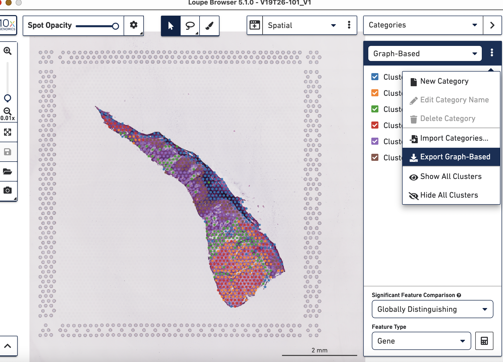

<!-- README.md is generated from README.Rmd. Please edit that file -->

```{r, include = FALSE}
knitr::opts_chunk$set(
  collapse = TRUE,
  comment = "#>",
  fig.path = "man/figures/README-",
  out.width = "100%"
)
```

# stmut: Somatic Mutation Investigation of Spatial Transcriptomics Data

<!-- badges: start -->
<!-- badges: end -->

Spatial transcriptomics technology allows scientists to map biological data to their spatial information to fully understand the biological process and disease development. Bioinformatic tools exploring and interpreting spatial transcriptomics data are in great need. Especially approaches to visualize point mutations and allelic imbalance in spatial transcriptomics data. 
CNVkit is a popular and broadly-used tool kit to investigate the copy number alteration in both DNA-seq and RNA-seq data. Based on [CNVkit-RNA](https://cnvkit.readthedocs.io/en/stable/rna.html) and samtools, we provide a R package called stmut via this github page. The stmut package includes a series of functions to visualize copy number variations (CNVs), point mutations, and allelic imbalance in spatial transcriptomics data. We also provide [the scripts producing the figures](https://github.com/limin321/stmut/blob/master/FigTableScripts/FigTables.md) in the manuscript, which also serves as a user guide for this package. In addition, this package is also be applicable to 10x single cell data analyses.  <br />

The functions in stmut package are organized into 3 parts: CNVs, point mutation, allelic imbalance.

This code was tested using R version 4.1.1, a macOS Monterey, Apple M1, 16G Memory. Given that spatial transcriptomics data normally have more than hundreds or thousands spots, we recommend use a high performance cluster to obtain point mutation and allelic imbalance for each spot.

## Installation 

You can install the development version of stmut from [GitHub](https://github.com/) with:

``` r
# install.packages("devtools")
devtools::install_github("limin321/stmut")
library(stmut)
```
#### Notes 
Bash scripts are displayed in `echo` command for your reference when you run your own data.

## I. Point Mutation Detection
You can run the following 5 functions: sptBClstRds, sptMutCt, nonZeRdCts, spotSummary, proposTumLoup sequentially to eventually generate a point mutation csv file for 10X Loupe Browser visualization. The color scheme can be customized in 10X Loupe Browser. The figures generated should be similar to the Figure 1 in our manuscript. Make sure the input files format matches with the examples provided by the package so as to smoothly run the codes. <br />

### Prepare the following 5 files from the spaceranger pipeline output: <br />
1. filtered_feature_bc.csv <br />
2. Graph-Based.csv, this file is exported from 10X Loupe Browser as shown below. <br />



3. possorted_genome_bam.bam <br />
4. spatial/tissue_positions_list.csv <br />
5. raw_feature_bc_matrix/barcodes.tsv.gz <br />

spotIndex generation: we save each barcode to an individual txt file, and the file is given a name as, for example, spot000.txt for the first spot. <br />
```{bash}
echo "zcat barcodes.tsv.gz | split -l1 -d -a 3 --additional-suffix=.txt - spot"
```

spotBam generation: the spot bam is generated as suggested by 
https://github.com/10XGenomics/subset-bam <br />
```{bash}
echo "subset-bam_linux --bam possorted_genome_bam.bam --cell-barcodes spot000.txt --out-bam spot000.bam"
echo "samtools index spot000.bam"
```

Count point mutation for each spot: we count the number of ref and mut reads using Mpileup_RNA.pl script [found here](./VisualizingSomaticAlterations/Scripts/). Make sure `samtools` is installed before running: <br />
```{bash}
echo "perl Mpileup_RNA.pl Patient4SomaticSNPs.txt spot000/MpileupOutput_RNA.txt"
```


#### Examples of running individual functions
This is a basic example of how to run sptBClstRds function:
```{r example}
 library(stmut)
## basic example code
files <- list.files(path = "./inst/extdata/spotIndex", pattern = ".txt", full.names = TRUE, recursive = FALSE)
data1 <- read.csv("./inst/extdata/filtered_feature_bc.csv", header = TRUE)
data2 <- read.csv("./inst/extdata/Graph-Based.csv", header = TRUE)
path <- "./inst/extdata/tissue_positions_list.csv"

df <- sptBClstRds(files=files,data1=data1, data2=data2, path=path)

head(df[[1]])
head(df[[2]])
```


An example on how to run sptMutCt()
```{r example2}
library(stmut)
index <- read.csv("./inst/extdata/spotBC.csv", header = TRUE)
files2 <- list.files(path = "./inst/extdata/mpileup",pattern = "MpileupOutput_RNA.txt", full.names = TRUE, recursive = TRUE, include.dirs = TRUE)
df1 <- sptMutCt(index = index, files = files2)

head(df1[[1]])
head(df1[[2]])
```

An example to run nonZeRdCts
```{r example3}
library(stmut)
d1 <- read.csv("./inst/extdata/spotBClster.csv", header = TRUE)
d2 <- read.csv("./inst/extdata/spotRdCtFinal.csv", header = TRUE)

dim(d1)
dim(d2)

df3 <- nonZeRdCts(df1 = d1, df2 = d2)
head(df3[[1]])
head(df3[[2]])
```

An example to run spotSummary
```{r example4}
library(stmut)
df <- read.csv("./inst/extdata/NonZeroRdSpotIndex.csv", header = TRUE)
path1 <-"./inst/extdata/mpileup/"

df4 <- spotSummary(df = df, path1 = path1)

head(df4)
```
Column meaning of df4: <br />
column 1: Spatial barcode <br />
column 2: Spot name <br />
column 3: Cluster in Loupe.Loupe file <br />
column 4: Total reads each spot has <br />
column 5: Row position in position_lists_bc.csv <br />
column 6: Column position in position_lists_bc.csv <br />
column 7: Reference read counts <br />
column 8: Mutant read counts <br />
column 9: Sum of Ref read counts and Mut read counts (sum of col 7 and col 8) <br />
column 10: The number ( < 10) in this column indicates how many mutant reads in a spot. For example, G9 means there are 9 mutant reads in that spot. However, G10 means there are more than 10 mutant reads in the spot. <br />
column 11: Proportion of # of mutant reads to Total reads (col8/col4) <br />
column 12: Proportion of # of mutant reads to sum of ref and mut reads (col8/col9) <br />
column 13: A binary column, when the spot has > 1 mutant read, it is 1, otherwise, it is 0. <br />
column 14: A score calculated based on the # of ref and mutant read counts. The higher the score is, the more likely it is a tumor spot. The table is sorted by this column. <br />
column 15: Details on which genes contain what mutations in which spots. <br />

## II. Copy Number Variation Detection
accStartCNR_CNS and bulkCNVs functions are used to generate arm-level bulk CNVs plot. <br />
wtArmMedianOne, CtArmGenes, cdt_filt_sort functions are used in generating spot CNVs heatmap. Case studay please refer [here](https://github.com/limin321/stmut/blob/master/FigTableScripts/FigTables.md#spatial-spot-cnvs-figure-3) <br />

An example to run wtArmMedianOne function
```{r}
library(stmut)
df <- read.csv("./inst/extdata/spot1_rep1.cnr", header = TRUE)
path1 <- read.csv("./inst/extdata/hg38_centromereSimple.bed", sep = "\t", header = FALSE) 

df5 <- wtArmMedianOne(data = cnr, centmere = centm)

head(df5[[1]])
head(df5[[2]])
```

An example to run CtArmGenes function
```{r}
library(stmut)
cdt <- read.table("./inst/extdata/cdt.cdt", header = TRUE)
d3 <- read.table("./inst/extdata/summary.txt", sep = "\t", header = TRUE) 

df6 <- CtArmGenes(cdt = cdt, data = d3)

head(df6)
```

An example to run cdt_filt_sort function
```{r}
library(stmut)
library(dplyr)
cdt <- read.table("./inst/extdata/cdt.cdt", header = TRUE)
data4 <- read.csv("./inst/extdata/CtArmGenSummary.csv",  header = TRUE)
arm <- c("1p","3p","3q","4q","5q","8q","9q","10p","10q","11q","13p","13q", "20p","20q","21q","14q","17q")
d4 <- data4 %>% filter(arms %in% arm)
genes <- d4[,"genes"]
rs <- d4[,"gene_row"]
gainLoss <- c(1,-1,1,-1,-1,1,1,-1,-1,1,-1,-1,1,1,-1,1,1)

df7 <- cdt_filt_sort(cdt = cdt,genes = genes,gainLoss = gainLoss,rs=rs)

head(df7)
```

## III. Allelic Imbalance 
accumStartPos and bulkLOHplot functions are for bulk DNAseq allelic imbalance plot.
The patient4_hg38_SNPs.txt and patient6_hg38_SNPs.txt files, which are saved [here](https://github.com/limin321/stmut/blob/master/VisualizingSomaticAlterations/DNAseqResourceFiles/), are used to count the # of major and minor alleles of each spot in patient4 and patient6.

Scripts generating the allelic imbalance figures(Figure 4 and Figure S6) in the manuscript is [here](https://github.com/limin321/stmut/blob/master/FigTableScripts/FigTables.md#bulk-dnaseq-allelic-imbalance)


```{r, include=FALSE}
# You'll still need to render `README.Rmd` regularly, to keep `README.md` up-to-date. `devtools::build_readme()` is handy for this. You could also use GitHub Actions to re-render `README.Rmd` every time you push. An example workflow can be found here: <https://github.com/r-lib/actions/tree/v1/examples>.
```

